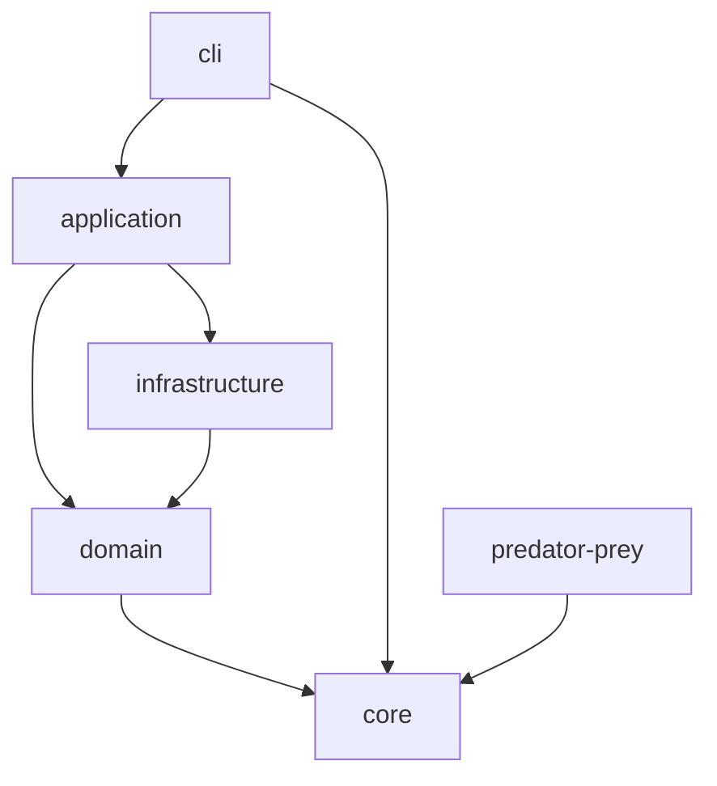
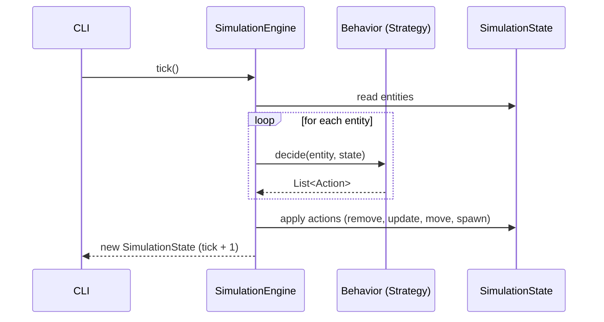

# Architecture Map

## Current Modules

### `core`
Core simulation abstractions and engine. Zero external dependencies beyond the standard library and Arrow.

**Contains:**
- Domain types: `Position`, `EntityId`, `Entity`, `Action` (sealed: `Move`, `Spawn`, `Remove`, `Update`)
- State: `SimulationState` (immutable world snapshot), `entitiesAt()` for spatial queries, `wander()` for random movement
- Logic: `Behavior` (fun interface, Strategy pattern), `SimulationEngine` (tick-based state transitions)

**Depends on:** nothing

### `predator-prey`
First concrete simulation built on top of `core`. Implements a predator-prey ecosystem.

**Contains:**
- `EntityType` enum (`PREY`, `PREDATOR`) with Arrow `Option` accessors for type-safe property reads
- Factory functions: `createPrey`, `createPredator`
- `PreyBehavior`: wander, lose energy, reproduce above threshold, die at zero energy
- `PredatorBehavior`: hunt prey at same cell (gain energy), wander, reproduce above threshold, die at zero energy
- `PredatorPreySimulation`: `createInitialState` and `run` using `runningFold` for pure functional tick loop

**Depends on:** `core`

## Planned Modules

| Module | Responsibility | Depends on |
|---|---|---|
| `domain` | Shared domain concepts (entity types, environment rules) | `core` |
| `application` | Orchestration, use cases, simulation lifecycle | `core`, `domain`, infrastructure interfaces |
| `infrastructure` | Persistence, external I/O, rendering | `core`, `domain` |
| `cli` | Command-line interface, user interaction | `application` |

## Dependency Rules

- `core` has **no outbound dependencies** — it is the innermost layer
- `domain` depends only on `core`
- `application` orchestrates domain and infrastructure but does not implement I/O directly
- `infrastructure` implements interfaces defined in `application` or `domain`
- `cli` is the outermost layer — depends on `application` for use cases
- **No circular dependencies** between modules

## Runtime Flow

