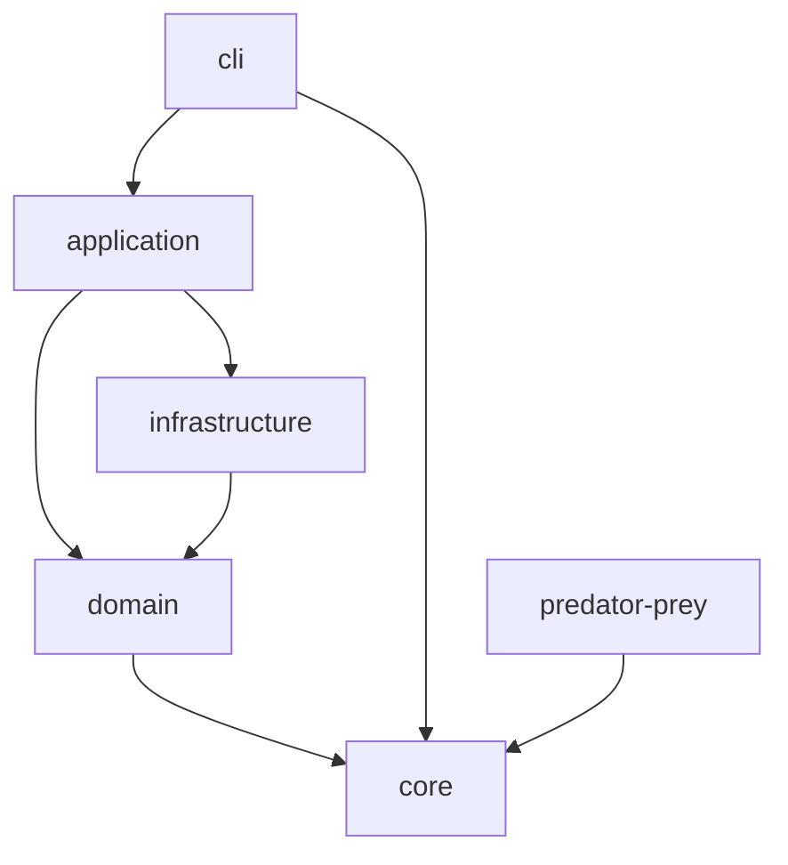
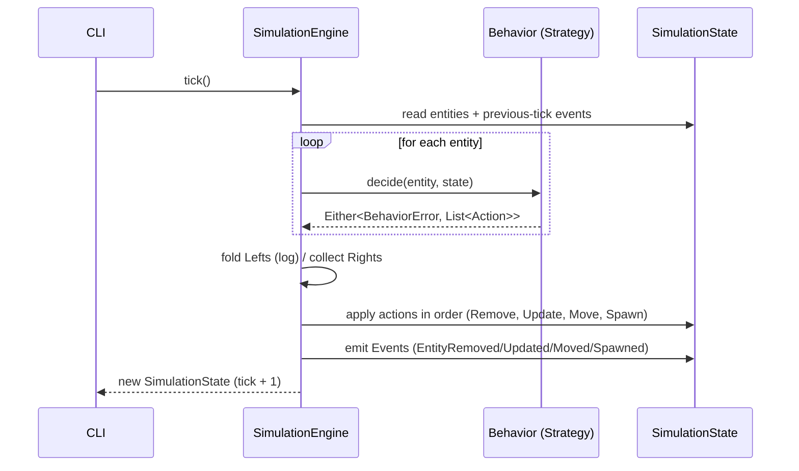

# Architecture Map

## Current Modules

### `core`
Core simulation abstractions and engine. Zero external dependencies beyond the standard library and Arrow.

**Contains:**
- Domain types: `Position`, `EntityId`, `Entity`
- Actions (sealed): `Move`, `Spawn`, `Remove`, `Update`
- Events (sealed): `EntitySpawned`, `EntityRemoved` (carries the full `Entity`), `EntityUpdated`, `EntityMoved`
- Errors: `BehaviorError` marker interface; built-in `EntityHasNoType`, `EntityHasNoEnergy`
- State: `SimulationState` (immutable world snapshot, exposes `events` from the previous tick), `entitiesAt()` for spatial queries, `wander()` for random movement
- Logic: `Behavior` (fun interface, Strategy pattern) returning `Either<BehaviorError, List<Action>>`; `SimulationEngine` (tick-based state transitions, emits events)

**Depends on:** Arrow (`Either`)

### `predator-prey`
First concrete simulation built on top of `core`. Implements a predator-prey ecosystem.

**Contains:**
- `EntityType` enum (`PREY`, `PREDATOR`) with Arrow `Option` accessors for type-safe property reads
- Factory functions: `createPrey`, `createPredator`
- FSM states (sealed): `PreyState` (`Wandering`, `Fleeing`), `PredatorState` (`Hunting`, `Feeding`); accessed via `Entity.preyState` / `Entity.predatorState` Arrow `Option` extensions
- Predator memory: `Entity.lastSeenPrey: Option<Position>` extension over the properties map
- Errors: `PredatorPreyError` sealed interface extending `BehaviorError`; `NoPreyToHunt`
- `PreyBehavior`: wander or flee from nearby `EntityRemoved` events; lose energy; reproduce above threshold; die at zero energy
- `PredatorBehavior`: feed on prey at same cell (gain energy, remember position), hunt toward last seen prey, wander when none known; reproduce above threshold; die at zero energy
- `PredatorPreySimulation`: `createInitialState` and `run` using `runningFold` for pure functional tick loop

**Depends on:** `core`

## Planned Modules

| Module | Responsibility | Depends on |
|---|---|---|
| `domain` | Shared domain concepts (entity types, environment rules) | `core` |
| `application` | Orchestration, use cases, simulation lifecycle | `core`, `domain`, infrastructure interfaces |
| `infrastructure` | Persistence, external I/O, rendering | `core`, `domain` |
| `cli` | Command-line interface, user interaction | `application` |

## Dependency Rules

- `core` has **no outbound dependencies** — it is the innermost layer
- `domain` depends only on `core`
- `application` orchestrates domain and infrastructure but does not implement I/O directly
- `infrastructure` implements interfaces defined in `application` or `domain`
- `cli` is the outermost layer — depends on `application` for use cases
- **No circular dependencies** between modules

## Runtime Flow

## Cross-cutting Concerns

### Error handling
Behaviors return `Either<BehaviorError, List<Action>>`. `BehaviorError` is a marker interface in `core`; each simulation defines its own sealed hierarchy (e.g. `PredatorPreyError`) so exhaustive matching stays local to the simulation. The engine `fold`s — Lefts are logged and produce no actions; Rights are flattened into the action stream.

### Entity state machines
FSM states live in the entity's `properties` map under the `"state"` key, but are read through typed Arrow `Option` extensions (`Entity.preyState`, `Entity.predatorState`). This keeps `core` ignorant of simulation-specific states while giving the simulation a type-safe accessor layer.

### Behavior memory
Per-entity memory (e.g. predator's `lastSeenPrey`) is also persisted via `properties` and exposed through Arrow `Option` extensions. No mutation: each tick produces an `Update` action that rebuilds the properties map.
